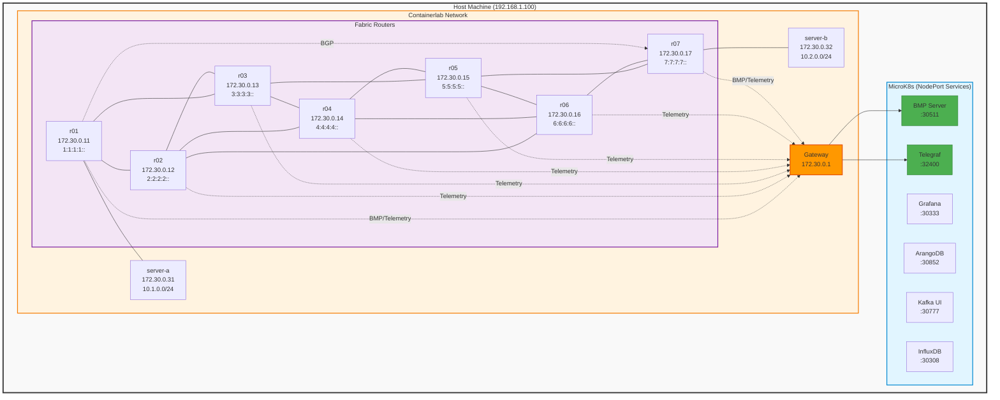

# Jalapeno BMP Demo - Single-Node Deployment

Showcase Jalapeno BMP Collection with Cisco XRd in a unified single-node deployment.

## Overview

This repository provides a complete single-node deployment combining:
- **MicroK8s**: Lightweight Kubernetes for Jalapeno stack
- **Jalapeno**: BMP collection and network observability platform
- **Containerlab**: Network topology with Cisco XRd routers
- **API Gateway (JAGW)**: GraphQL API for network data

## Architecture

### Network Diagram



The deployment runs entirely on a single host:
- **Jalapeno Services** (via MicroK8s NodePort):
  - BMP Server (gobmp): Port 30511
  - Telegraf Ingress: Port 32400
  - Grafana: Port 30333
  - ArangoDB: Port 30852
  - InfluxDB: Port 30308
  - Kafka UI: Port 30777
- **Containerlab Network**:
  - Management Network: 172.30.0.0/24
  - 7 XRd routers (r01-r07)
  - 2 Linux hosts (server-a, server-b)
  - XRd routers send BMP/telemetry to host IP: 172.30.0.1

## Prerequisites

- Ubuntu 22.04 or later
- Minimum 16GB RAM, 8 CPU cores
- Python 3.10+
- Ansible installed on deployment machine
- SSH access to target host

## Configuration

### Password Management

This deployment requires several passwords to be configured:

#### 1. SSH Password (Target Host)
The Ansible playbook will prompt for the SSH password to access the target host as user `ins`.

#### 2. Docker Registry Credentials
If using a private Docker registry (default: `registry.gitlab.ost.ch:45023`), configure credentials:

**Option A - Environment Variables**:
```bash
export DOCKER_USER=your_username
export DOCKER_PASSWORD=your_password
make deploy
```

**Option B - Command Line**:
```bash
make deploy DOCKER_USER=your_username DOCKER_PASSWORD=your_password
```

**Option C - Ansible Extra Vars**:
```bash
cd deploy
ansible-playbook -u ins -k site.yaml -e "docker_user=your_username" -e "docker_password=your_password"
```

If credentials are not provided, the deployment will skip Docker registry login (using placeholder defaults).

#### 3. XRd Router Passwords
Router CLI passwords are configured in `deploy/config/r*.cfg` files:
- Default username: `cisco` (r01, r02, r04-r07) or `ins` (r03)
- Default password: `very_secure_password`

**To customize router passwords**, edit the `secret` line in each router config file:
```
username cisco
 secret YOUR_CUSTOM_PASSWORD
```

After deployment, access routers via:
```bash
ssh cisco@172.30.0.11  # Use your configured password
```

## Quick Start

### One-Command Deployment

```bash
make deploy
```

This will:
1. Check dependencies
2. Generate Ansible inventory
3. Deploy MicroK8s and Jalapeno
4. Deploy Docker and Containerlab
5. Start the network topology

### Step-by-Step Deployment

1. **Configure target host**:

   Edit `deploy/labs.yaml` and add your host IP(s):
   ```yaml
   labs:
     - 192.168.1.100  # Your server IP
   ```

2. **Setup Python environment** (optional, for development):

   ```bash
   cd deploy
   uv sync
   source .venv/bin/activate
   ```

3. **Generate inventory**:

   ```bash
   make setup-inventory
   ```

   Review the generated `deploy/inventory.yaml` before proceeding.

4. **Run deployment**:

   ```bash
   make deploy
   ```

   You will be prompted for the SSH password for user `ins` on the target host.

## Network Topology

The Containerlab topology includes:
- **Fabric routers**: r01-r07 (ISIS + SRv6 + BGP-LS)
- **Customer sites**:
  - Site A: server-a (10.1.0.0/24) connected to r01
  - Site B: server-b (10.2.0.0/24) connected to r07
- **BMP Configuration**: r01 and r07 configured with BMP server pointing to host

## Access Points

After deployment, access services via:

- **Grafana**: http://\<host-ip\>:30333 (anonymous access enabled)
- **ArangoDB UI**: http://\<host-ip\>:30852
- **Kafka UI**: http://\<host-ip\>:30777
- **InfluxDB**: http://\<host-ip\>:30308

## IP Schema

### Single-Node Architecture

```
Host Machine (e.g., 192.168.1.100)
├── MicroK8s (NodePort services on host IP)
│   ├── BMP Server: 0.0.0.0:30511
│   └── Telegraf: 0.0.0.0:32400
└── Containerlab (mgmt network: 172.30.0.0/24)
    ├── Host bridge IP: 172.30.0.1 (gateway)
    ├── r01: 172.30.0.11
    ├── r02: 172.30.0.12
    ├── r03: 172.30.0.13
    ├── r04: 172.30.0.14
    ├── r05: 172.30.0.15
    ├── r06: 172.30.0.16
    ├── r07: 172.30.0.17
    ├── server-a: 172.30.0.31
    └── server-b: 172.30.0.32
```

XRd routers send BMP and telemetry data to **172.30.0.1** (the host bridge IP), which routes to MicroK8s NodePort services.

## Management

### Destroy Topology

```bash
make destroy
```

### Manual Operations

**Check Containerlab status**:
```bash
sudo containerlab inspect -t deploy/closing.clab.yaml
```

**Access router CLI**:
```bash
ssh cisco@172.30.0.11  # Password: very_secure_password (or your custom password)
```

**Check Jalapeno pods**:
```bash
kubectl get pods -n jalapeno
```

**View BMP connections**:
```bash
kubectl logs -n jalapeno -l app=gobmp
```

## Troubleshooting

### BMP Connection Issues

If routers cannot connect to BMP server:
1. Verify MicroK8s service is running: `kubectl get svc -n jalapeno gobmp`
2. Check host firewall allows NodePort traffic
3. Verify Containerlab network can reach host: `sudo docker exec -it clab-closing-r01 ping 172.30.0.1`

### Containerlab Network Issues

If containers cannot reach host services:
1. Check Docker bridge network: `docker network inspect clab`
2. Verify iptables are not blocking: `sudo iptables -L -n | grep 172.30`
3. Test connectivity from router: `sudo containerlab exec -t deploy/closing.clab.yaml --label clab-node-name=r01 "ping 172.30.0.1"`

## Development

The repository structure:
```
.
├── Makefile                    # Main deployment entry point
├── deploy/                     # Ansible playbooks and configs
│   ├── site.yaml              # Main playbook (single-node)
│   ├── labs.yaml              # Host configuration
│   ├── inventory-template.yaml.j2
│   ├── gen-inv.yaml           # Inventory generator
│   ├── closing.clab.yaml      # Containerlab topology
│   ├── config/                # XRd router configurations
│   └── tasks/                 # Ansible task files
└── infrastructure/            # Original split-host configs (deprecated)
```

## Migration Notes

This repository has been migrated from a split-host architecture to single-node:
- **Previous**: Separate hosts for Jalapeno (jagw) and Containerlab (infra)
- **Current**: Unified deployment on single host
- **Key Change**: XRd routers now point to 172.30.0.1 (host bridge) instead of 192.168.250.11
