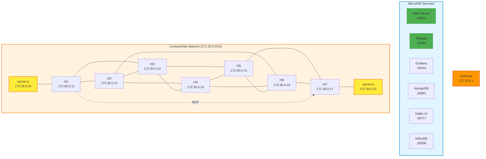

# Jalapeno BMP Demo - Single-Node Deployment

Showcase Jalapeno BMP Collection with Cisco XRd in a unified single-node deployment.

## Overview

This repository provides a complete single-node deployment combining:
- **[MicroK8s](https://github.com/canonical/microk8s)**: Lightweight Kubernetes for Jalapeno stack
- **[Jalapeno](https://github.com/cisco-open/jalapeno)**: BMP collection and network observability platform
- **[Jalapeno API Gateway](https://github.com/jalapeno-api-gateway)**: gRPC API for network data
- **[Containerlab](https://github.com/srl-labs/containerlab)**: Network topology with Cisco XRd routers

## Architecture

### Network Diagram



The deployment runs entirely on a single host:
- **Jalapeno Services** (via MicroK8s NodePort):
  - BMP Server (gobmp): Port 30511
  - Telegraf Ingress: Port 32400
  - Grafana: Port 30333
  - ArangoDB: Port 30852
  - InfluxDB: Port 30308
  - Kafka UI: Port 30777
- **Containerlab Network**:
  - Management Network: 172.30.0.0/24
  - 7 XRd routers (r01-r07) running ISIS + SRv6 + BGP-LS
  - 2 Linux hosts (server-a at 10.1.0.0/24, server-b at 10.2.0.0/24)
  - XRd routers send BMP/telemetry to host IP: 172.30.0.1
  - BMP Configuration: r01 and r07 configured with BMP server
  - Customer sites: Site A (server-a) connected to r01, Site B (server-b) connected to r07

## Prerequisites

- Ubuntu 22.04 or later
- Minimum 16GB RAM, 8 CPU cores
- Python 3.10+
- Ansible (install with `make install-deps` if not present)
- SSH access to target host (or run locally on the target host)
- Cisco XRd control-plane Docker image (see below)

### XRd Image Setup

The lab requires the Cisco XRd control-plane Docker image. Load it into your local Docker registry:

```bash
# Extract the XRd control-plane tarball
tar -xvzf xrd-control-plane-container-x86.7.11.1.tgz

# Load the XRd image into Docker
docker load -i xrd-control-plane-container-x64.dockerv1.tgz-7.11.1

# Tag the image (if needed)
docker tag <loaded-image-id> ios-xr/xrd-control-plane:25.3.1
```

## Configuration

### Inventory Setup

The deployment uses `deploy/inventory.yaml` to define the target host.

**Default (localhost)**: Deploy on the current machine
```yaml
all:
  hosts:
    localhost:
      ansible_connection: local
```

**Remote host**: Deploy to a remote server
```yaml
all:
  hosts:
    remote_host:
      ansible_host: 192.168.1.100  # Your server IP
      ansible_port: 22
      ansible_user: ins
      # Use SSH keys or will prompt for password
```

Edit `deploy/inventory.yaml` to match your deployment target.

## Quick Start

### One-Command Deployment

```bash
make deploy
```

This will:
1. Check dependencies
2. Deploy MicroK8s and Jalapeno
3. Deploy Docker and Containerlab
4. Start the network topology

### Step-by-Step Deployment

1. **Configure target host**:

   Edit `deploy/inventory.yaml`:
   - For localhost deployment: Use default configuration
   - For remote host: Uncomment and update the remote_host section

2. **Setup Python environment** (optional, for development):

   ```bash
   cd deploy
   uv sync
   source .venv/bin/activate
   ```

3. **Run deployment**:

   ```bash
   make deploy
   ```

   If deploying to a remote host, you may be prompted for the SSH password.

## Access Points

After deployment, access services via:

- **Grafana**: http://\<host-ip\>:30333 (anonymous access enabled)
- **ArangoDB UI**: http://\<host-ip\>:30852
- **Kafka UI**: http://\<host-ip\>:30777
- **InfluxDB**: http://\<host-ip\>:30308

## Management

### Destroy Topology

```bash
make destroy
```

### Manual Operations

**Check Containerlab status**:
```bash
sudo containerlab inspect -t clab/bmp.clab.yaml
```

**Access router CLI**:
```bash
ssh cisco@172.30.0.11  # Username: cisco, Password: very_secure_password
```

**Check Jalapeno pods**:
```bash
kubectl get pods -n jalapeno
```

**View BMP connections**:
```bash
kubectl logs -n jalapeno -l app=gobmp
```
